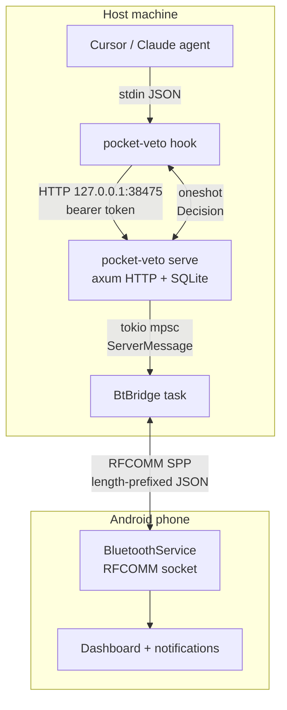

# Architecture companion

This is a companion to [../ARCHITECTURE.md](../ARCHITECTURE.md), which is the
canonical reference. Read that first. This page focuses on the data flow and
the cfg-gated backends so you can navigate the code quickly.

## Data flow

The round trip for an approval request:

1. The agent invokes `pocket-veto hook` with a `PreToolUse` payload on stdin.
2. The hook normalizes the payload (auto-detects Cursor vs Claude), POSTs an
   approval to `POST /approvals`, then long-polls `GET /approvals/:id/wait`
   with a 300-second timeout.
3. The server creates a row in the `approvals` table, registers a
   `oneshot::Sender` in `ApprovalWaiters`, stashes the receiver in
   `AppState::pending_receivers`, and forwards an `ApprovalRequest` frame to
   the bridge outbox.
4. The bridge encodes the frame and writes it over the `BtTransport`.
5. The phone's `BluetoothService` reads the frame, posts an action-button
   notification, and updates the dashboard.
6. The user taps Allow / Deny / Reply. The phone writes an
   `ApprovalDecision` frame back.
7. The bridge reads it, persists the decision to SQLite, and calls
   `ApprovalWaiters::resolve(approval_id, decision)` — which fires the
   oneshot the hook is blocked on.
8. The hook's `GET /wait` returns, the hook converts the decision to
   host-specific stdout JSON, and exits 0 (allow / ask) or 2 (deny /
   fail-closed).

Fire-and-forget events (`PostToolUse`, `Stop`, `SessionStart`, etc.) skip
steps 2-7: the hook POSTs to `POST /events` and exits 0 immediately. The
server persists the event, publishes it to the in-process `EventBus`, and
forwards an `AgentEvent` frame to the bridge outbox for the phone.

## cfg-gated backends

`pocket-veto-bt` is the only crate with `#[cfg(target_os = ...)]` conditional
dependencies. The platform backends are:

| Module | cfg gate | Backend | System dep |
| --- | --- | --- | --- |
| `pocket-veto-bt/src/linux.rs` | `target_os = "linux"` AND `feature = "linux-bt"` | `bluer` (BlueZ, RFCOMM `Listener::bind`) | `libdbus-1-dev` at build time, `bluetoothd` at runtime |
| `pocket-veto-bt/src/windows.rs` | `target_os = "windows"` | `serialport` crate on a paired SPP COM port | none (pure Rust) |
| `pocket-veto-bt/src/macos.rs` | `target_os = "macos"` | `compile_error!` stub | none |
| `pocket-veto-bt/src/mock.rs` | always compiled | in-memory `mpsc` channels | none |

The `linux-bt` cargo feature is **default-off** so the workspace builds in
environments without `libdbus-1-dev` (the devcontainer, CI runners that do
not install it). Enable it with `cargo build --features pocket-veto-bt/linux-bt`. The
`serialport` dependency on Windows is not feature-gated because it is pure
Rust and compiles cleanly with no system headers.

The `bridge.rs` module is platform-agnostic: it depends only on the
`BtTransport` trait. This is what lets the same bridge logic drive a real
RFCOMM listener, a Windows COM port, or an in-memory `MockTransport` in tests.

## Where to look in the code

| Concern | File |
| --- | --- |
| Wire protocol, frame codec, message enums | `crates/pocket-veto-core/src/protocol.rs` |
| Cursor vs Claude normalization | `crates/pocket-veto-core/src/normalize.rs` |
| Host-specific stdout JSON | `crates/pocket-veto-core/src/output.rs` |
| SQLite schema and stores | `crates/pocket-veto-core/src/db.rs` |
| Approval oneshot registry | `crates/pocket-veto-core/src/approvals.rs` |
| In-process event bus | `crates/pocket-veto-core/src/events.rs` |
| Config loader | `crates/pocket-veto-core/src/config.rs` |
| Library error types | `crates/pocket-veto-core/src/error.rs` |
| HTTP server, AppState, bridge spawn | `crates/pocket-veto/src/serve.rs` |
| Hook subcommand (stdin -> server -> stdout) | `crates/pocket-veto/src/hook.rs` |
| init subcommand (interactive setup) | `crates/pocket-veto/src/init.rs` |
| clap dispatch | `crates/pocket-veto/src/main.rs` |
| BtTransport trait, BtBridge, reconnect/heartbeat/replay | `crates/pocket-veto-bt/src/bridge.rs` |
| Mock transport for tests | `crates/pocket-veto-bt/src/mock.rs` |
| Linux RFCOMM backend | `crates/pocket-veto-bt/src/linux.rs` |
| Windows COM port backend | `crates/pocket-veto-bt/src/windows.rs` |

Each crate also has an `AGENTS.md` with technical notes and mandatory
rules.
